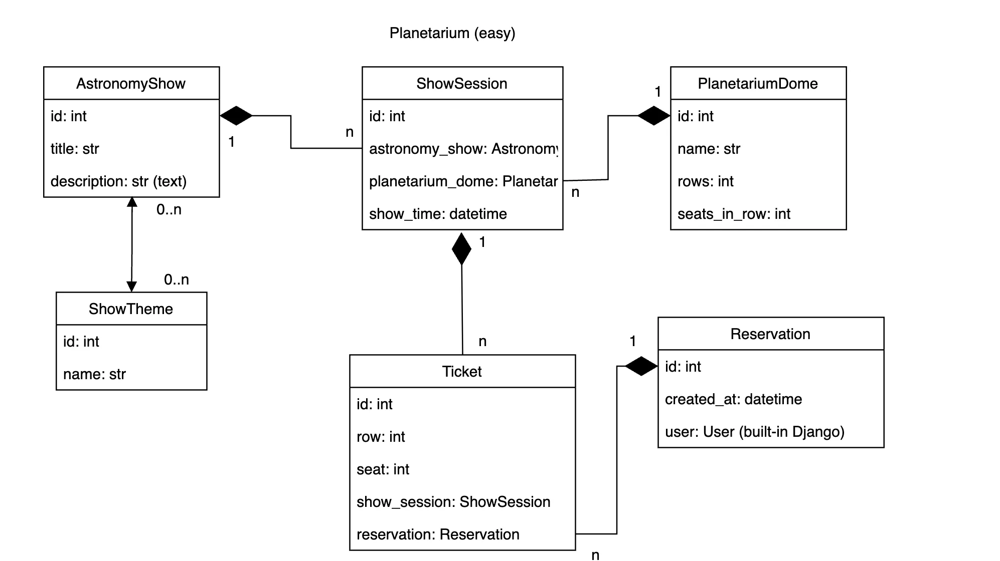

# Planetarium API Service

This is an API for Planetarium which allows to buy tickets for astronomy shows.

## Features
You can read, add, edit and delete astronomy shows, show themes, planetarium domes and show sessions.
* **Authorized** users can only read
* **Admin** users can read, add, edit and delete

## Installing using Docker
Docker should be installed

```shell
git clone https://github.com/MarianKovalyshyn/planetarium-api-service.git
cd planetarium-api-service/
docker-compose build
docker-compose up
```

## Installing using GitHub
Install PostgreSQL and create a database.

```shell
git clone https://github.com/MarianKovalyshyn/planetarium-api-service.git
cd planetarium-api-service/
python -m venv venv
source venv/bin/activate (MacOS)
venv\Scripts\activate (Windows)
pip install -r requirements.txt
set DB_HOST=<your_host>
set DB_NAME=<your_db_name>
set DB_USER=<your_db_user>
set DB_PASSWORD=<your_db_password>
set SECRET_KEY=<your_secret_key>
python manage.py migrate
python manage.py runserver
```

## To get access
* create user at /api/user/register/
* get access token at /api/user/token/

## DB schema

